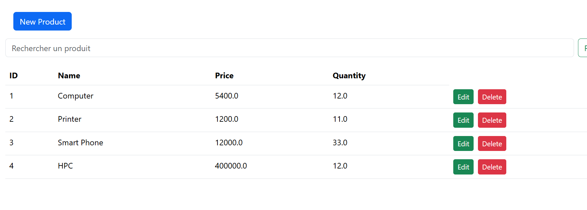

# Application Spring MVC avec Gestion de Produits et Sécurité

---

## Présentation générale du projet

Ce projet est une application web développée avec **Spring Boot** et **Spring MVC** qui permet la gestion d’un catalogue de produits.  
Elle offre des fonctionnalités classiques CRUD (Créer, Lire, Mettre à jour, Supprimer) sur les produits.

L’accès aux différentes fonctionnalités est sécurisé grâce à **Spring Security**, qui restreint l’accès selon les rôles des utilisateurs :  
- Les utilisateurs avec le rôle **USER** peuvent consulter et interagir avec certaines pages.  
- Les utilisateurs avec le rôle **ADMIN** ont des droits étendus (exemple : création, modification et suppression de produits).

---

## Structure et fonctionnement global de l’application

### 1. **Entité Product**

La classe `Product` représente un produit avec les attributs suivants :  
- `id` (clé primaire)  
- `name` (nom du produit)  
- `price` (prix)  
- `quantity` (quantité en stock)

Cette entité est mappée à une base de données relationnelle via JPA et Lombok est utilisé pour la génération automatique des getters, setters et constructeurs via `@Data` et `@Builder`.

---

### 2. **ProductRepository**

```java
public interface ProductRepository extends JpaRepository<Product, Long> {
    List<Product> findByNameContains(String keyword);
}
```

Cette interface étend `JpaRepository` et fournit toutes les méthodes standard pour manipuler les produits (recherche, sauvegarde, suppression).

---

### 3. **Initialisation des données**

La classe principale `BdccFsmSpringMvcApplication` initialise des données de test via un bean `CommandLineRunner` :

```java
@Bean
public CommandLineRunner start(ProductRepository productRepository) {
    return args -> {
        productRepository.save(Product.builder().name("Computer").price(5400).quantity(12).build());
        productRepository.save(Product.builder().name("Printer").price(1200).quantity(11).build());
        productRepository.save(Product.builder().name("Smart Phone").price(12000).quantity(33).build());

        productRepository.findAll().forEach(p -> System.out.println(p.toString()));
    };
}
```

---

### 4. **Templates Thymeleaf**

L’application utilise **Thymeleaf** pour le rendu HTML des vues, avec des templates structurés :  
- Un layout général réutilisable (navbar, messages, etc.)  
- Des vues spécifiques pour :  
  - La liste des produits  
  - La modification des produits 
  - Le formulaire d’ajout  
  - La barre de recherche intégrée  
  - La page de login  
  - La page d’erreur "non autorisé"

Thymeleaf permet un rendu dynamique selon les rôles grâce aux balises `sec:authorize`.

---

### 5. **Configuration de Spring Security**

La sécurité repose sur la classe `SecurityConfig`, où sont définies :  
- L'encodage des mots de passe avec BCrypt  
- Des utilisateurs en mémoire avec rôles distincts (`USER`, `ADMIN`)  
- Les autorisations d’accès aux URL selon les rôles  
- La page personnalisée de login et la gestion des erreurs d'accès refusé

Protection CSRF :
Les formulaires critiques (ex : suppression, modification) utilisent la méthode POST et incluent un token CSRF

---

### 6. **Fonctionnalités principales**

- **CRUD produits** : consulter, ajouter, modifier et supprimer un produit.  
- **Sécurité par rôle** : `ADMIN` a un accès total, `USER` a un accès limité.  
- **Recherche** : filtrage des produits par nom.  
- **Thymeleaf dynamique** : contenu des pages dépendant du rôle connecté.  
- **Gestion d’erreur** : redirection vers une page personnalisée si accès non autorisé.

---

### 7. **Flux utilisateur**

- Redirection vers `/login` si l’utilisateur non connecté accède à une page protégée  
- Navigation selon les rôles après login (pages `/admin/**` ou `/user/**`)  
- Message d'erreur et redirection vers `/notAuthorized` en cas d'accès interdit

---

### 8. **Base de données H2**

L’application utilise une base **H2 en mémoire**, pratique pour le développement.  
La console est accessible via `/h2-console`.  
La configuration dans `application.properties` permet la création automatique des tables.

---

## Captures d'écran

### 1. Login en tant qu’administrateur


### 2. Page d’accueil de l’admin


### 3. Modifier un produit (fonction Edit)


### 4. Liste après modification


### 5. Rechercher un produit par nom (SearchBar)


### 6. Créer un nouveau produit


### 7. Liste après ajout du produit


### 8. Suppression des produits


### 9. Login avec user1


### 10. Accueil d’un simple utilisateur


### 11. Accès refusé à une page interdite


---

## Conclusion

Cette application illustre une intégration complète de :  
- Spring Data JPA pour la persistance des données  
- Spring Security pour la gestion des rôles et de l'authentification  
- Thymeleaf pour le rendu dynamique des pages web  
- Fonctionnalités modernes comme la recherche et la modification des produits

Elle constitue une base solide pour tout projet de gestion sécurisé avec interface web.

---

**Auteur :** Mayssam Sehait — Étudiante en DataScience & Intelligence Artificielle  
